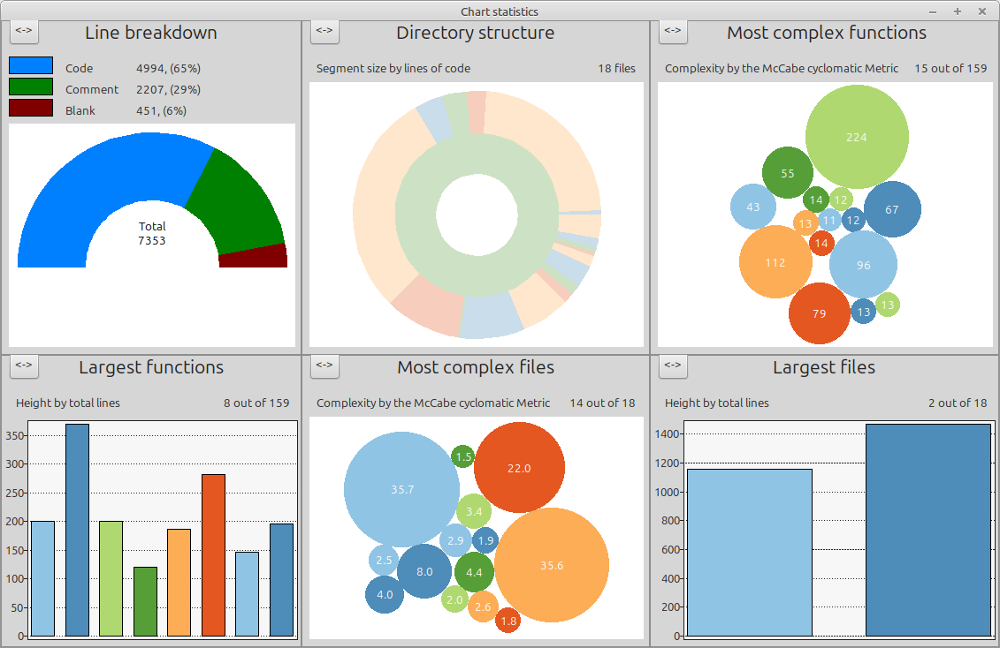

# Loop

>
> Attention, this is a work in progress ...
>

As a student of Computer Science at the University of Stuttgart, I developed this loop interpreter for Windows in Delphi 5 as a semester project in 2006.
In this repository, I am working to revive the “old” code using Lazarus and to make it platform-independent.

Loop is a µ-recursive language that is not Turing-complete and always terminates. As students, we were able to explore the properties of this language (additional sources: [wikipedia](https://en.wikipedia.org/wiki/LOOP_(programming_language))
).

Unfortunately, all programming tasks for Loop had to be carried out purely as thought experiments and on paper. The interpreter I designed changes this situation by enabling programs to be written and executed.

### Progress of porting the code to Lazarus

2025.12.11 - create initial GitHub repository 
2025.12.12 - first version that compiles and does not crash during startup (did FPC_Understand analysis)
