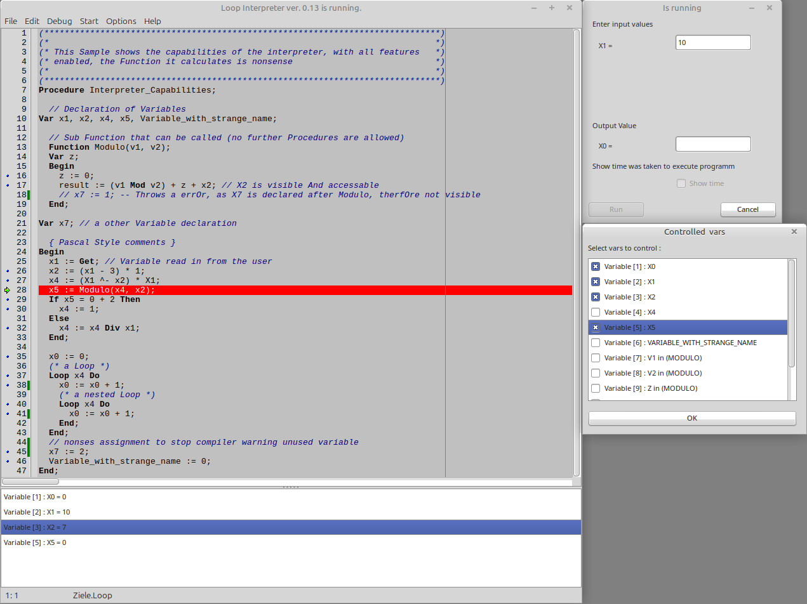

# Loop

Loop is a fully usable interpreter for the Loop language (Loop on [wikipedia](https://en.wikipedia.org/wiki/LOOP_(programming_language))). As this interpreter uses a bit "more" than defined by Loop its recommended to also read the [manual](Manual.md).

As a student of Computer Science at the University of Stuttgart, I developed this loop interpreter for Windows in Delphi 5 as a semester project in 2006.

In this repository, I am working to revive the “old” code using Lazarus, to make it platform-independent and make it usable for more students who want to test their Loop applications ;).

The Interpreter features:
- Multiple color chemes
- Code formator
- Optional Language enhancements:
  - ^- modified substraction
  - \* multiplication
  - "complex" arithmetics like x0 := (x1 + x2) * x3
  - If Then Else
  - Integer to boolean operands like >, <, >=, <=, <>
  - Mod, modulo operator
  - Div, integer division
  - functions
  - other variable names than x*
- implicit variable initialization with 0
- Breakpoints and a step by step debugger
- Whatched variables
- Lots of samples
